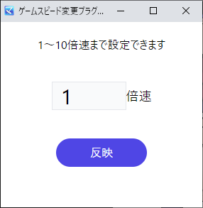

# RPGツクールMV用ゲームスピード変更プラグイン

このプラグインを導入したゲームでは、Alt+bキーかAlt+1～9でプレイヤーがいつでも任意に動作速度を変更できるようになります。1～10倍速まで対応。MZ版は[こちら](https://github.com/doujinreviewers/DRS_BoostEngine)

## 使い方
### Alt+bキーでUIを表示する

ゲーム中にAlt+bキーを押すと下記のような画面が別途開きます。

1から10までのいずれかの数値を入力して反映ボタンを押すと起動中のゲームに反映されます。

この画面を閉じてもAlt+bキーでいつでも開けます。

### Alt+数字キーで使う

UIを表示しなくてもショートカットキーで動作します。

例えばゲーム中にAlt+5を押すと5倍速になり、Alt+1キーを押すと通常速度に戻ります。

10倍速はショートカットキーから設定できないので、10倍速にしたい場合はUIを開いて設定してください。

## 導入方法
1. [DRS_BoostEngineMV.js](https://github.com/doujinreviewers/DRS_BoostEngineMV/releases/download/v1.0.0/DRS_BoostEngineMV.js)をダウンロード
2. DRS_BoostEngineMV.jsを\[ツクールMVのプロジェクトフォルダ]\js\pluginsに配置
3. ツクールMVを起動してプラグイン管理からDRS_BoostEngineMVを選択してONにする

- テストプレイから動作確認

  ツクールMVのテストプレイを実行し、ゲームを起動してAlt+bキーを押すか、Alt+1～9の数字キーを押す

## build
1. `npm install`
2. `npm run build-all`

## ライセンス
MIT